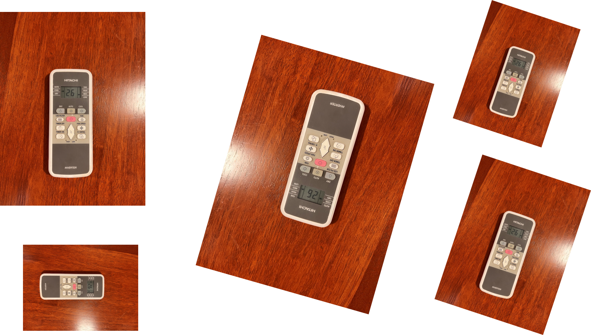
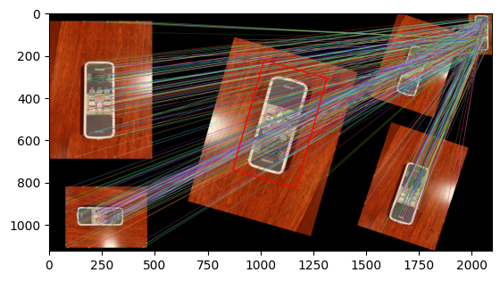
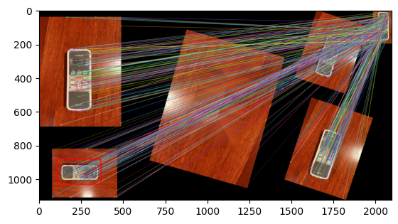
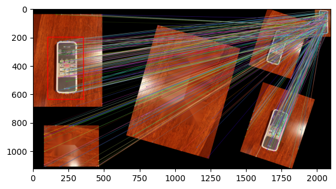
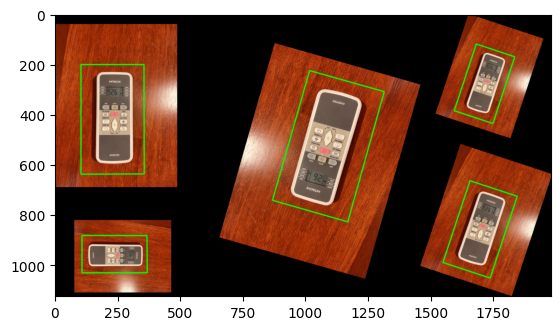

# Multi scale multi object template matching

This Python script demonstrates the use of OpenCV to find matching objects in an image using feature detection and matching techniques. The script supports two methods: Scale-Invariant Feature Transform (SIFT) and Oriented FAST and Rotated BRIEF (ORB).

If you find it helps, please feel free to give me a star. ⭐⭐⭐


## Features

- Detect and match objects in images using SIFT or ORB methods.
- Adjustable parameters for matching accuracy.
- Capability to handle multiple object matching in a single image.

## Requirements

- Python 3.x
- OpenCV
- NumPy
- Matplotlib (optional for visualization)

## How to use

You can just clone this repository and run:

```
python template_matching.py
```

If you want to use your own images, scroll down to the bottom where you'll find the section `# Example Usage` This is where you can test your own images and parameters.

```python
matching_method = "SIFT" # "SIFT" or "ORB"

img1 = cv2.imread('i_remoter.png') # Image
template = cv2.imread('t_remoter.png') # Template

params = {
    'max_matching_objects': 10,
    'SIFT_distance_threshold': 0.85,
    'best_matches_points': 500
}
```

#### More

1. If you want to check every matching iteration, you can uncomment the ```# Draw the bounding box``` part. Uncomment this part:


```python
# # You can uncomment the following lines to see the matching process
# # Draw the bounding box
# img1_with_box = matching_img.copy()
# matching_result = cv2.drawMatches(img1_with_box, keypoints1, template, keypoints2, good_matches, None, flags=cv2.DrawMatchesFlags_NOT_DRAW_SINGLE_POINTS)
# cv2.polylines(matching_result, [np.int32(transformed_corners)], True, (255, 0, 0), 3, cv2.LINE_AA)
# plt.imshow(matching_result, cmap='gray')
# plt.show()
```


2. All code is in `template_matching.py`. I make the template matching in a function, so that you can easily import/copy it to your own code base.


## Explanation

You can use SIFT or ORB to match templates with scale and rotation. After the first match, the matched area is filled with near neighbor pixels for the next match.


Image:  
  


Template:  
  

Matching:  


Remove matching area for next matching:  


Matching:  


and repeat matching...

Final result:  
  

## Reference

https://docs.opencv.org/4.8.0/d1/de0/tutorial_py_feature_homography.html  
https://datascience.stackexchange.com/questions/27330/python-feature-matching-homography-to-find-multiple-objects  
